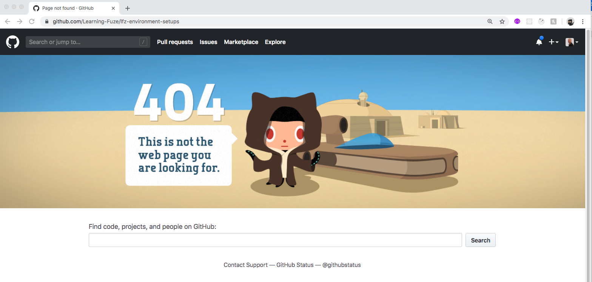
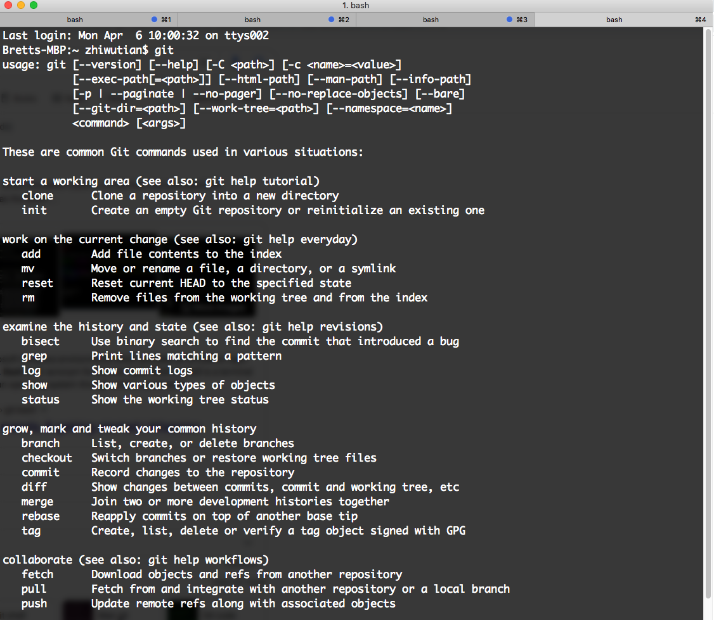
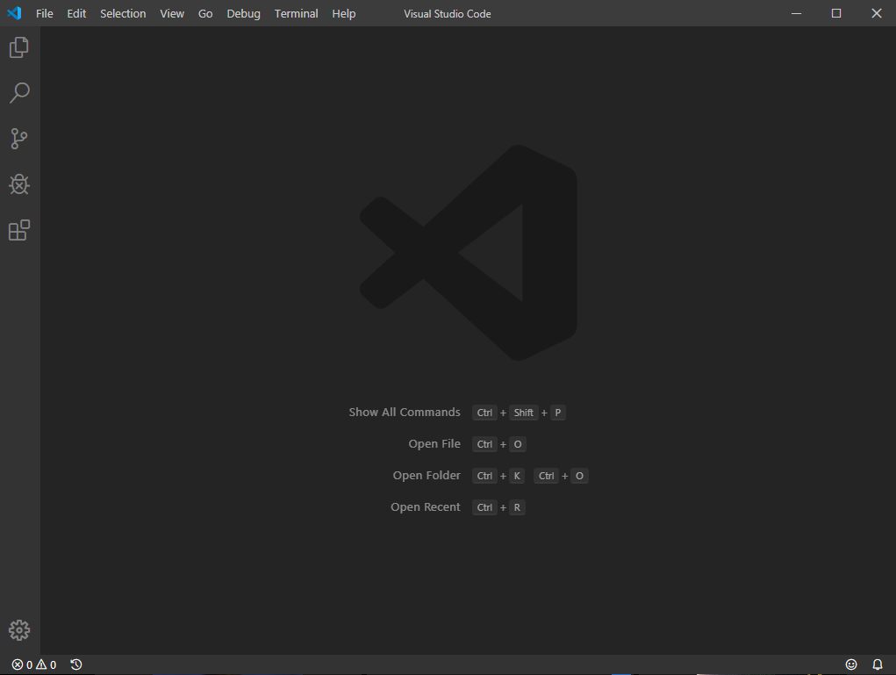

# lfz-environment-setup

The following is a step by step guide to setting up the LearningFuze coding environment which you will be using for all LearningFuze related exercises, challenges, and coding activities.

If you experience any issues during the setup process, please reach out in the proper `question queue` for instructor assistance. We are here to help!!!

1. Submit your Github name in the slack channel.

1. Download and install the Google `Chrome` browser if you do not already have it installed.
    - The LearningFuze programs use the `Chrome` browser exclusively.
    - Install link: https://www.google.com/chrome/?brand=CHBD&gclid=EAIaIQobChMIkfDJ9pei6AIVpBitBh0F5gqFEAAYASAAEgIAkvD_BwE&gclsrc=aw.ds
1. Download and install the `Zoom` Desktop client.
    - Zoom will be used for all remote classes and all remote student help.
    - Install link: https://zoom.us/download
1. Using the instructions located in the `lfz-code` repository, install `VS code` and `git` / `git bash`.
    - The LearningFuze programs uses a specially configured version of `VS code`. If you already have it installed on your system, you will need to delete it during the setup process.
        - Note: Instructions for both `Mac` and `Windows` have both automatic installation and manual installation instructions.
        - If you are unable to complete automatic installation, please install using the manual instructions.
    - Installation instructions for `Mac` users: https://github.com/Learning-Fuze/lfz-code#macos-instructions
    - Installation instructions for `Windows` users: https://github.com/Learning-Fuze/lfz-code#windows-instructions
        - Note: If you see the example screen below when following one of the above links, there are two possible reasons:
            - You are not logged in to `Github`
                - Logging it will fix this
            - You have not been added to the `Github` team.
                - Give your `Github` name to an instructor so you can be added.
        - Example output:
        
1. When the above installation is complete, you must confirm that git (on `Mac`) / git bash (on `Windows`) was installed correctly.
    - On `Mac`, open the `Terminal` application, and type `git` into the command line and press `enter`.
    - On `Windows` open the `Git Bash` application, and type `git` into the command line and press `enter`
    - If `Git` has been properly installed you should see the following output in the command line window:
        - Example output:
        

    - What you are seeing is a list of `Git` commands, this means installation is complete.
    - If you do not see the above output, contact an instructor for assistance!!
1. When the above installation is confirmed, it is time to confirm that `VS Code` is installed correctly.
    - Open `VS Code` and confirm that the bar on the bottom of your window is black:
        - Example `VS Code` screen:
        
        - Example of black back:
        
    - If the bar is not black, contact an instructor so that they can assist you with getting the proper build of `VS Code`.
1. When the above installation is confirmed, it is time to install the `Slack` app.
    - The desktop/laptop application is required for all `LearningFuze` programs as it is much easier to miss notifications when using the web application.
    - Installation downloads link: https://slack.com/downloads/
    - After installation is complete, make sure to open the application and log in to confirm you are in the proper `LearningFuze` workspace.
1. When the above installation is complete and you are properly logged into `Slack`, it is time to `fork` the `Github` repository which contains all of the exercises and resources for the class.
    - Link for Root lessons repo: https://github.com/Learning-Fuze/lfz-root1-lessons
    - Watch the video below on forking a repository:
        - Forking Video: https://youtu.be/pRhr2Ia6i70
1. When the above forking is complete, it is time to configure `Git` with your name and email so that it can correctly track and manage the code you will be working on in this and other LearningFuze programs.
    - Watch the video below on configuring `Git`:
        - Git config video: https://youtu.be/kdwH4680WuA
1. When `Git` has been properly configured, it is time to clone down your forked version of the `lfz-root1-lessons` repository.
    - 
